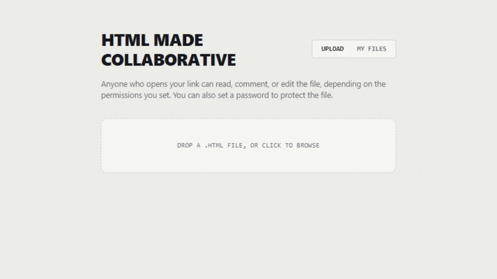
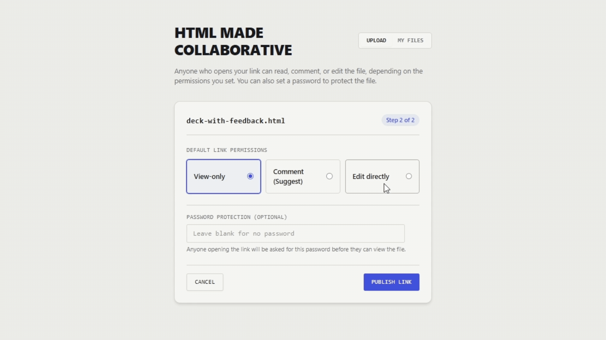
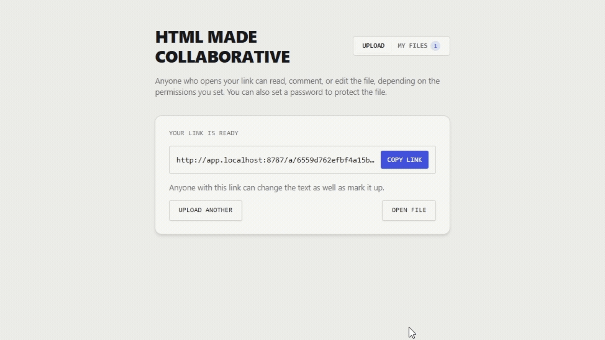
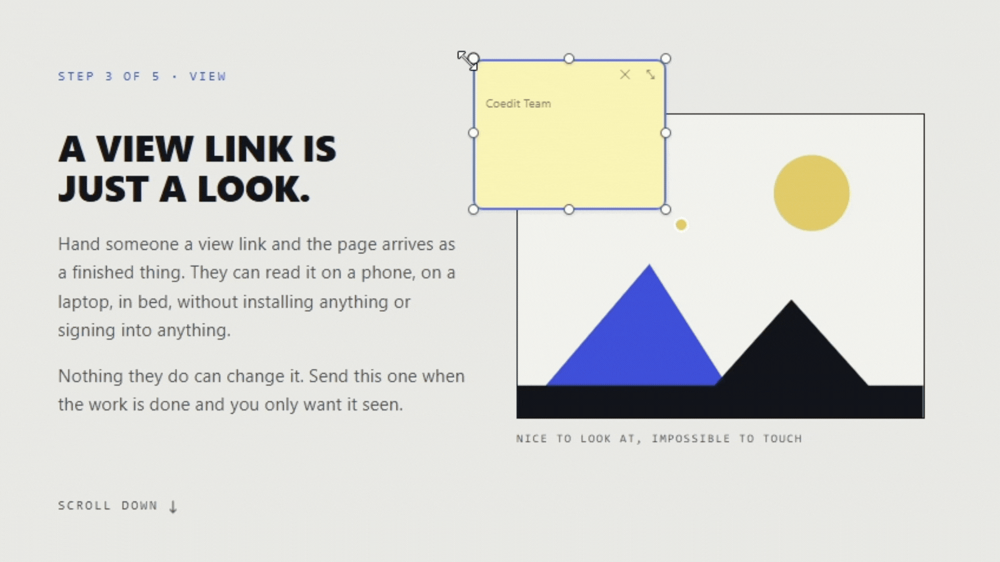

<h1 align="center">coedit<b>HTML</b></h1>

<p align="center">Share, view, comment on, and edit HTML artifacts in the browser.</p>

- Website: [coedithtml.com](https://coedithtml.com)
- App: [app.coedithtml.com](https://app.coedithtml.com)

## How It Works

### 1. Upload your file

Drop in any self-contained HTML file up to 5MB, including embedded styles and scripts. No build steps or configuration required.



### 2. Choose permissions

Set access to view, comment, or edit. You can also add an optional password to protect sensitive files.



### 3. Share the link

Collaborators open the live file directly in their browser. They can highlight text to comment, drop sticky notes anywhere, or edit copy in place.



### 4. Collect feedback and edits

Review all comments and edits in an organized sidebar. Copy everything as clean markdown or download the updated HTML file with changes applied.



## Architecture

The project uses two origins:

- **App origin** (`app.coedithtml.com`): UI chrome, share controls, comment rail, and file lists. Holds session cookies.
- **Sandbox origin** (`coedit.coedithtml-worker.workers.dev`): Serves uploaded HTML inside a sandboxed `<iframe>`. Holds no credentials.

Communication between origins uses origin-checked `postMessage` or same-origin requests. CORS is not used.

### Packages

| Package     | Description                                                  |
| ----------- | ------------------------------------------------------------ |
| `app/`      | React and Vite web application                               |
| `worker/`   | Cloudflare Worker API, artifact storage, and Durable Objects |
| `runtime/`  | Editor script with zero dependencies                         |
| `protocol/` | Shared types, message schemas, and anchor definitions        |
| `website/`  | Public site using Next.js static export                      |

### Storage

- **R2** (`ARTIFACT_STORE`): Artifact files, deduplicated by content hash.
- **KV** (`ARTIFACT_METADATA`): Document metadata and share tokens.
- **Durable Objects**: `DocRoom` for room state and websockets; `RateLimiter` and `UsageLedger` for rate limits.

## Local Development

Prerequisites: Node 22+ and pnpm.

```bash
pnpm install
pnpm dev
```

Local URLs:

- App: http://app.localhost:8787
- Tutorial: http://app.localhost:8787/tutorial
- Sandbox: `sandbox.localhost:8787`

For MCP endpoints, copy `worker/.env.example` to `worker/.dev.vars` and set `MCP_SIGNING_SECRET`.

### Commands

| Command          | Description             |
| ---------------- | ----------------------- |
| `pnpm dev`       | Start app and worker    |
| `pnpm test`      | Run tests               |
| `pnpm typecheck` | Run TypeScript checks   |
| `pnpm lint`      | Run ESLint and Prettier |
| `pnpm build`     | Build all packages      |

## Deployment

Requirements: Cloudflare account with Workers, R2, KV, and Durable Objects.

1. Create an R2 bucket and KV namespace, then update their IDs in `worker/wrangler.jsonc`.
2. Configure `APP_HOST` and `SANDBOX_HOST` to two different origins.
3. Set secrets: `wrangler secret put MCP_SIGNING_SECRET --env production`.
4. Deploy the worker: `pnpm deploy`.
5. Deploy the marketing site: `pnpm --filter @coedithtml/website run deploy`.

## Contributing

See [CONTRIBUTING.md](CONTRIBUTING.md) for contribution guidelines.

Report security issues according to [SECURITY.md](SECURITY.md).

## License

MIT — see [LICENSE](LICENSE).
